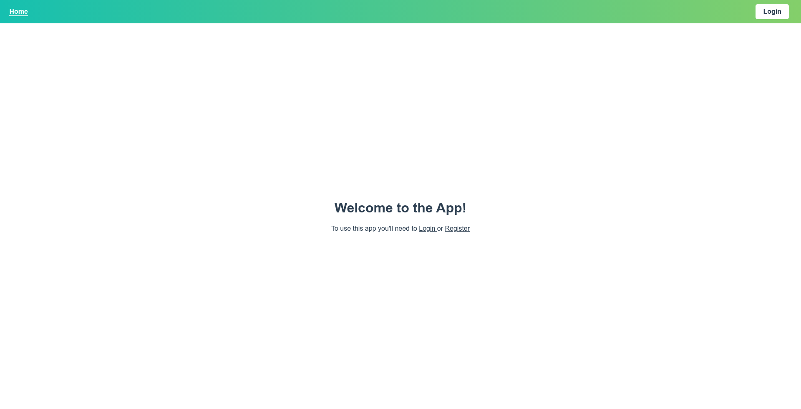
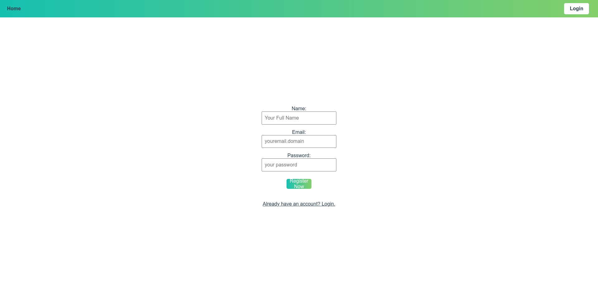
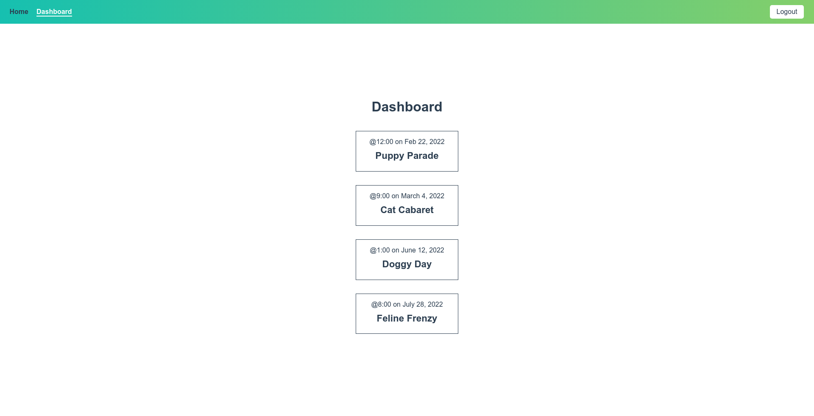

<br/>
<p align="center">
  <h1 align="center">Vue Auth</h1>

  <p align="center">
    Implement Auth for Vue Js project using Vuex, Vue Router
    <br/>
    <br/>
  </p>
</p>


   

## About The Project



for reference, how to use vuex, vue router for authentication

## Built With

Vue js, Vuex, Vue Router

## Getting Started


### Installation

1. Clone the repo

```sh
https://github.com/fajar7xx/vue-auth-token
```

2. Install NPM packages

```sh
npm install
```

4. run your app

```sh
npm run start
```

## ScreenShots






### Creating A Pull Request

1. Fork the Project
2. Create your Feature Branch (`git checkout -b feature/AmazingFeature`)
3. Commit your Changes (`git commit -m 'Add some AmazingFeature'`)
4. Push to the Branch (`git push origin feature/AmazingFeature`)
5. Open a Pull Request

## License

Distributed under the MIT License. See [LICENSE](https://github.com/fajar7xx/vue-auth-token/blob/main/LICENSE.md) for more information.

## Authors

* **Fajar Siagian** - *Full Stack Web Developer* - [Fajar Siagian](https://github.com/fajar7xx) - *vue auth token*

